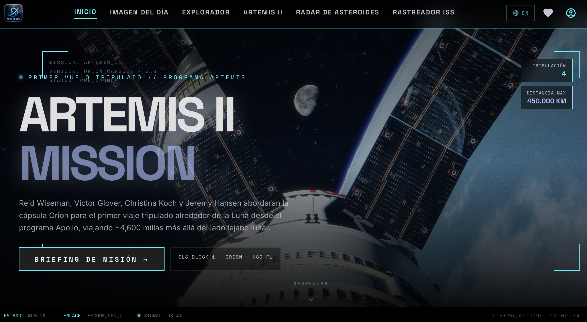
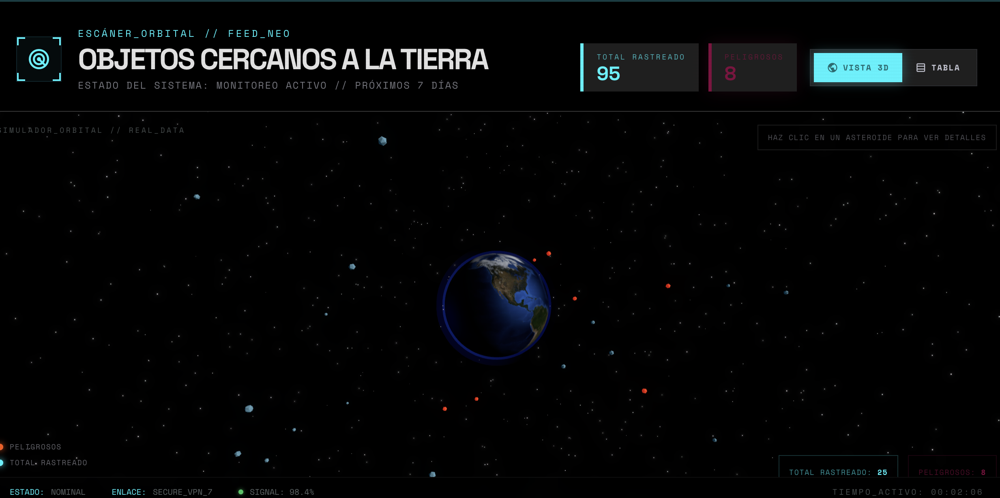

# Deep Space Explorer 🚀

An immersive, high-fidelity web application for cosmic exploration. **Deep Space Explorer** integrates real-time data from NASA and CelesTrak to provide a stunning 3D experience of our near-earth environment.

🌐 **Live demo**: [https://deepspaceexplorer.alejandrocastellanos0827.workers.dev/](https://deepspaceexplorer.alejandrocastellanos0827.workers.dev/)



## 🌌 Key Features

- **3D Asteroid Radar**: Real-time visualization of Near-Earth Objects (NEOs). Features a logarithmic distance scale and the Moon as a visual reference (1 LD).
- **Satellite Tracking System**: Real-time 3D propagation of thousands of satellites (ISS, Starlink, GPS, Weather) using `satellite.js` and CelesTrak TLE data.
- **Artemis II Mission Hub**: Comprehensive mission manifest, detailed timeline, and high-quality portraits of the Artemis II crew.
- **NASA Media Integration**: Daily "Astronomy Picture of the Day" (APOD) with detailed context and a searchable media gallery.
- **Dynamic Lighting**: 3D globe lighting synchronized with the user's current UTC time (Sidereal Time) for a realistic day/night cycle.
- **Multilingual UI**: Fully localized in English and Spanish with a corrected language selection status.

## 📸 Screenshots

### Asteroid Radar 3D


### NASA Picture of the Day


## 🛠️ Technology Stack

- **Framework**: React 19 + Vite
- **3D Engine**: Three.js + React Three Fiber
- **State & Data**: React Query (TanStack Query) + Axios
- **Physics**: satellite.js (TLE Propagation)
- **Styling**: Vanilla CSS + HUD/Glassmorphism design system
- **Icons**: Google Material Symbols

## 🚀 Getting Started

1. **Clone the repository**:
   ```bash
   git clone https://github.com/alejandrocastellanos/Deep-Space-Explorer.git
   ```

2. **Install dependencies**:
   ```bash
   npm install
   ```

3. **Configure Environment**:
   Create a `.env` file based on `.env.example`:
   ```env
   VITE_NASA_API_KEY=YOUR_NASA_API_KEY
   ```

4. **Run Development Server**:
   ```bash
   npm run dev
   ```

## ☁️ Deploy to Cloudflare Pages (CLI with Wrangler, no Git)

Use this method to publish the site directly from your machine without connecting a Git repository.

1. **Install Wrangler globally**:
   ```bash
   npm install -g wrangler
   ```

2. **Authenticate with Cloudflare** (opens the browser):
   ```bash
   wrangler login
   ```

3. **Build the production bundle**:
   ```bash
   npm run build
   ```

4. **Deploy the build output**:
   ```bash
   wrangler deploy
   ```

After the first deploy the site will be available at `https://deepspaceexplorer.<your-subdomain>.workers.dev`. Re-run steps 3–4 any time you want to publish a new version.

> **SPA routing**: `wrangler.jsonc` configures `not_found_handling: "single-page-application"`, so any unknown route is served as `index.html` automatically. No `_redirects` file is needed (and in fact causes an infinite-loop validation error on Cloudflare).
>
> **Environment variables**: set `VITE_NASA_API_KEY` in your local `.env` before running `npm run build` (Vite inlines `VITE_*` vars at build time), or configure it in the Cloudflare dashboard if you switch to Git-based auto-deploys.

## 📜 License
This project is licensed under the MIT License - see the [LICENSE](LICENSE) file for details.
